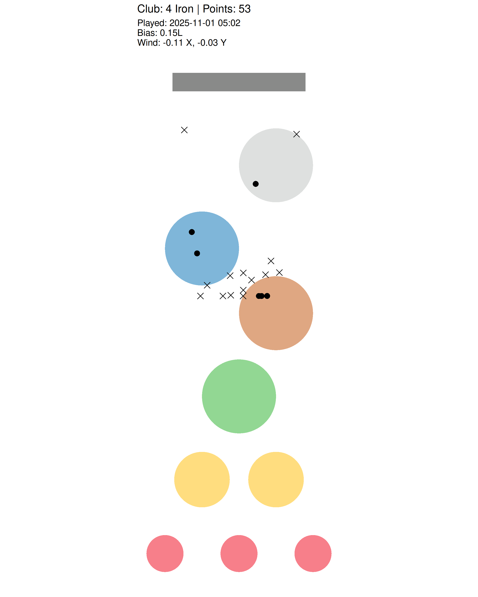

# golfr

Daily Topgolf Simulation in R ⛳️📊

Welcome to **golfr**, an R-powered project that simulates a daily Topgolf round with realistic shot physics, player tendencies, and environmental effects — all visualized beautifully.

## What golfr Does

- Runs a daily simulation of 20 shots using R, modeling various clubs and player skill.
- Incorporates **player bias** (left/right shot tendencies) and **wind effects** for realism.
- Scores shots against multiple colored targets and a bonus trench zone.
- Produces a clean plot showing shots as hits (dots) or misses (crosses), plus round stats.

## How It Works

- **Automated via GitHub Actions:**  
  The workflow triggers daily at 5:00 AM UTC, running the R script `src/simulate_game.R` and updating the plot.

- **Shot Simulation Details:**  
  - Clubs modeled with distance means and variability  
  - Shots offset by wind and player bias  
  - Skill factor adjusts shot consistency

- **Outputs:**  
  - A plot (`topgolf-sim.png`) visualizing targets, shots, and round stats  
  - Console output with detailed round metrics (hits, misses, points, bias, wind)

## See the Latest Game

*Timestamp and conditions appear on the plot subtitle.*



---

## Running golfr Locally

1. Install R packages:

   ```r
   install.packages(c("dplyr", "ggplot2", "ggforce"))
   ```

2. Run the simulation script:

   ```bash
   Rscript src/simulate_game.R
   ```

3. View the updated plot:

   [topgolf-sim.png](topgolf-sim.png)
